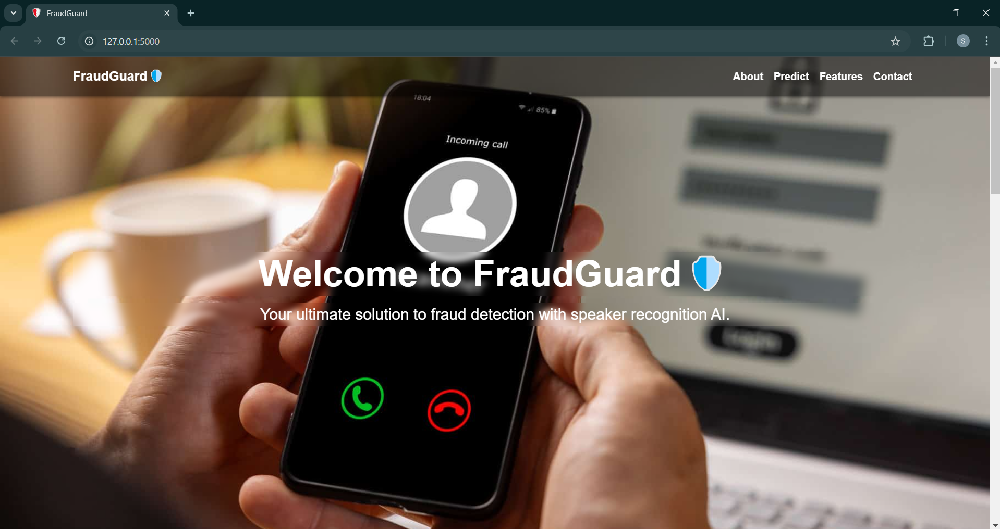
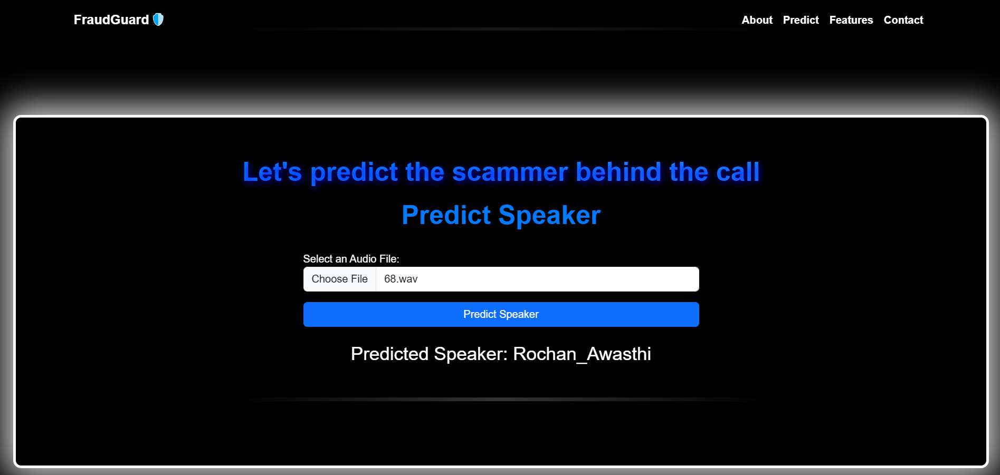
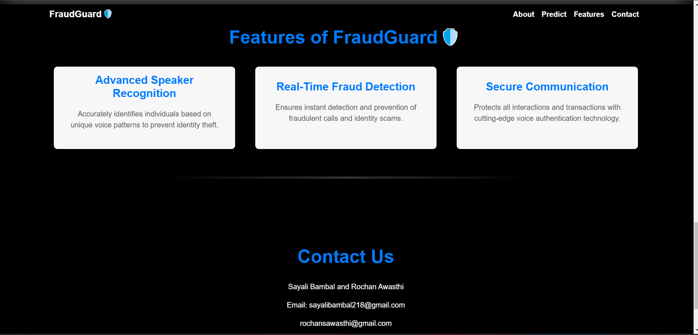

# FraudGuard: AI/ML-Based Speaker Identification for Cybercrime Detection

## Project Overview

FraudGuard is an AI/ML-based speaker identification system designed to enhance cybersecurity by
 preventing voice-based fraud, such as phising and unauthorized access. It integrates 
 fraud detection using voice biometrics.

## Table of Contents

- [Model Details](#model-details)
- [Dataset Details](#dataset-details)
- [Performance Metrics](#performance-metrics)
- [FraudGuard Features](#fraudguard-features)
- [Future Improvements](#future-improvements)
- [Installation](#installation)
- [Usage](#usage)
- [Inference](#inference)
- [Contributors](#contributors)


## Example Images





## Model Details

- **Model Used** : CNN-based Deep Learning Model
- **Feature Extraction** :  Mel-Frequency Cepstral Coefficients (MFCCs)
- **Optimizer** : Adam (Learning Rate: 0.001)
- **Loss Function** : Cross-Entropy Loss
- **Epochs** : 15
- **Batch Size** : 32

## Dataset Details

- **Total Speakers**: 8 (5 from dataset from kaggle +3 custom recorded)
- **Total Recordings**: 1,500 per speaker
   - **Training**: 1400 samples
   - **Testing**: 100 samples
- **Total Duration**: 2600 minutes
- **Noise Data**: 1-hour for background differentiation

## Performance Metrics
- **Model Accuracy**: 76.8%
- **Comparison**: Outperformed GMM and SVM models
- **Data Augmentation**: Noise addition, speech speed variation for robustness

## FraudGuard Features
- It recognises wether the voice sample matches the original speaker or not.
- Prevents unauthorized access to secure services
- Applications in banking, law enforcement, and cybersecurity

## Future Improvements
- Real-time speaker verification for fraud prevention
- Enhance noise reduction algorithms
- Integrate multi-modal biometrics (voice + facial recognition)


## Installation & Usage

1. **Clone the repo**:
- Clone the repository:  git clone https://github.com/your-username/solar-panel-extraction.git

2. **Run the Application**:
   - Open a terminal.
   - Run the following command:
     ```
     python app.py
     ```
   - The terminal will provide a link, usually `http://127.0.0.1:5000`. Open this link in your web browser.

3. **Using the Web Application**:
   - The webpage for our application, Fraud Guard, will automatically open.
   - Scroll down and click the "Choose File" button.
   - Select an audio file from your computer.
   - The webpage will display the output, showing the name of the speaker.


## Contributors

- Rochan Awasthi (https://www.linkedin.com/in/rochan-awasthi-393242302/) (https://github.com/Macbeth1501) 
- Sayali Bambal (https://www.linkedin.com/in/sayali-bambal-1a6241302/) (https://github.com/SayaiB24)  
- Ananya Rajurkar

From CE 2nd year, St. Vincent Palloti College of Engineering and Technology, Nagpur

## License
This project is under a Proprietary License. Viewing is allowed, but copying, modifying, or distributing is strictly prohibited.
